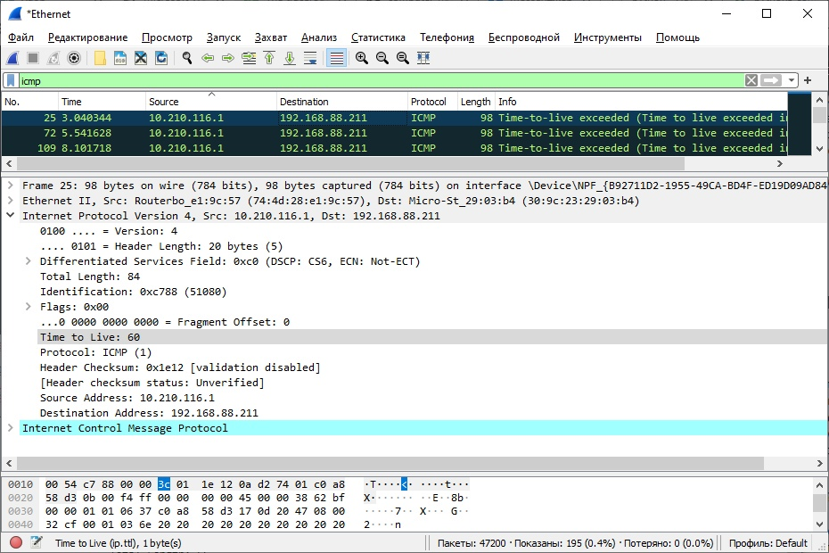

### Задание 1.

1. Мой адрес: 192.168.88.211

2. В поле протокола указано ICMP (1)

3. В IP заголовке - 20 байт, на полезную нагрузку приходится оставшиеся 36 байт.

4.  * Изменяемые поля: `TTL`, `identification`, `checksum`
    *  Не изменяемые поля: `IP адреса`, `размер пакета`, `флаги`, 
       `differentiated services field`, `версия протокола`
       
    * Поле `identification` при каждом следующем запросе увеличивается.
    

5. Поле `identification` занимает 2 байта и используется для распознавания пакета.
Поле `TTL` содержит время жизни для него. Например, `TTL = 15` и `identification = 0x62c9`
   

6. В такой ситуации поле `TTL` остается неизменным, поле `identification` меняется.

7. `TTL = 60` и `identification = 0xc9bb`

8. * Да, сообщение было фрагментировано на 3 ip-датаграммы

   * Меняются поля: `Checksum`, `Fragment offset`. Теоретически может меняться и `Total length`.
    

