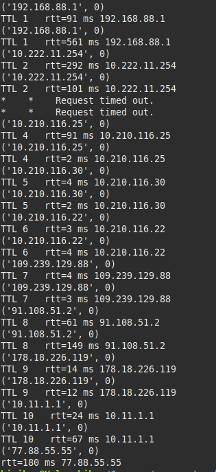

### Запуск: 
`sudo python3 main.py host_name` 

Пример:



Полный запрос:

```
 $ sudo python3 main.py yandex.ru
('192.168.88.1', 0)
TTL 1   rtt=91 ms 192.168.88.1
('192.168.88.1', 0)
TTL 1   rtt=561 ms 192.168.88.1
('10.222.11.254', 0)
TTL 2   rtt=292 ms 10.222.11.254
('10.222.11.254', 0)
TTL 2   rtt=101 ms 10.222.11.254
*    *    Request timed out.
*    *    Request timed out.
('10.210.116.25', 0)
TTL 4   rtt=91 ms 10.210.116.25
('10.210.116.25', 0)
TTL 4   rtt=2 ms 10.210.116.25
('10.210.116.30', 0)
TTL 5   rtt=4 ms 10.210.116.30
('10.210.116.30', 0)
TTL 5   rtt=2 ms 10.210.116.30
('10.210.116.22', 0)
TTL 6   rtt=3 ms 10.210.116.22
('10.210.116.22', 0)
TTL 6   rtt=4 ms 10.210.116.22
('109.239.129.88', 0)
TTL 7   rtt=4 ms 109.239.129.88
('109.239.129.88', 0)
TTL 7   rtt=3 ms 109.239.129.88
('91.108.51.2', 0)
TTL 8   rtt=61 ms 91.108.51.2
('91.108.51.2', 0)
TTL 8   rtt=149 ms 91.108.51.2
('178.18.226.119', 0)
TTL 9   rtt=14 ms 178.18.226.119
('178.18.226.119', 0)
TTL 9   rtt=12 ms 178.18.226.119
('10.11.1.1', 0)
TTL 10   rtt=24 ms 10.11.1.1
('10.11.1.1', 0)
TTL 10   rtt=67 ms 10.11.1.1
('77.88.55.55', 0)
rtt=180 ms 77.88.55.55

```