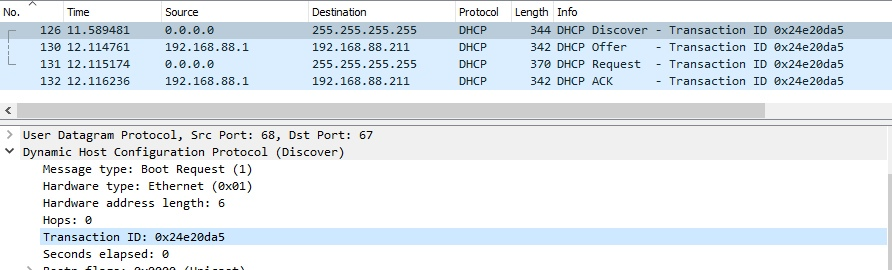

## Wireshark

1. Сообщения отправляются поверх протокола UDP.

2. Адрес 30:9c:23:29:03:b4

3. Transaction ID: 0x24e20da5. Позволяет клиенту распознать, какому DCHP запросу какой
   соответствует ответ.
   

4. До присвоения IP исходящий хост имеет IP-адрес, равный 0.0.0.0,
принимающий хост имеет IP, равный 255.255.255.255.
   

5. Source Address: 192.168.88.1

6. DHCP-сервер назначает ip адрес на определенный срок, после чего адрес освобождается, 
если срок не был продлен. В моем случае: 10 минут
   

