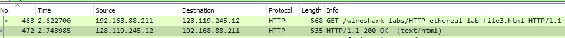
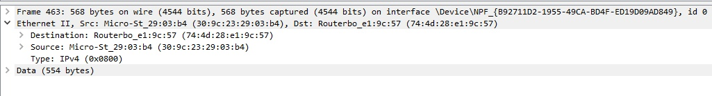
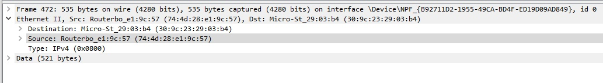
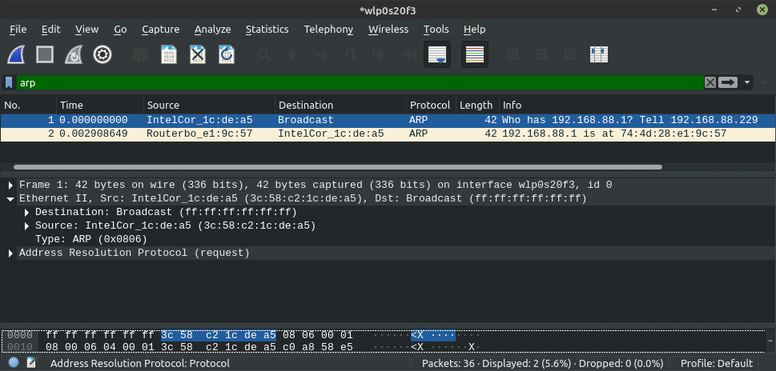
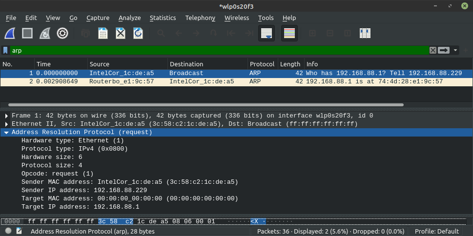
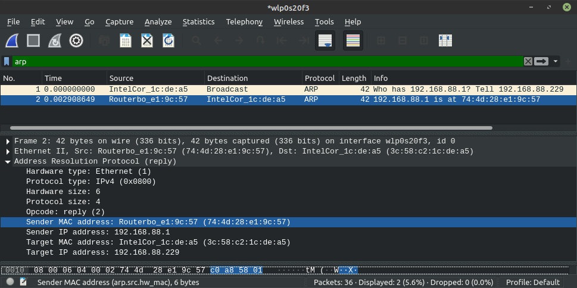

## Wireshark

### Задание 1

1. Source: 30:9c:23:29:03:b4 - адрес моего компьютера
   
2. Соответствует адресу моего сетевого адаптера.

   
3. Source: 74:4d:28:e1:9c:57, соответствует адресу сетевого адаптера сервера.

4. Это адрес моего компьютера: Destination: Micro-St_29:03:b4 (30:9c:23:29:03:b4)

### Задание 2
В этом задании поменял устройство и систему.

1. Исходный адрес: Source: 3c:58:c2:1c:de:a5
Destination: Broadcast (ff:ff:ff:ff:ff:ff)

2. Да, Sender IP address: 192.168.88.229

3. Есть, Target MAC address. Равен 0, т.к. неизвестен Ethernet-адрес машины, 
   чей IP мы запросили.
   
4. Sender MAC address: Routerbo_e1:9c:57 (74:4d:28:e1:9c:57)
