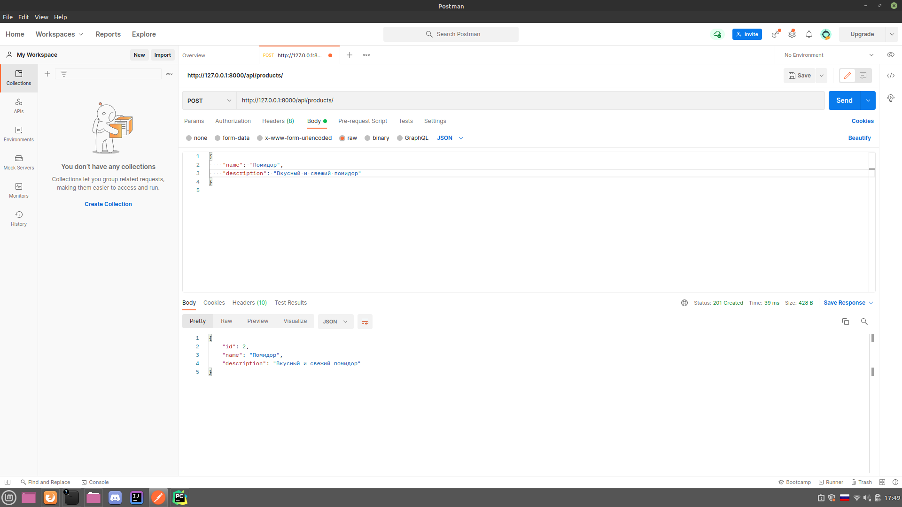
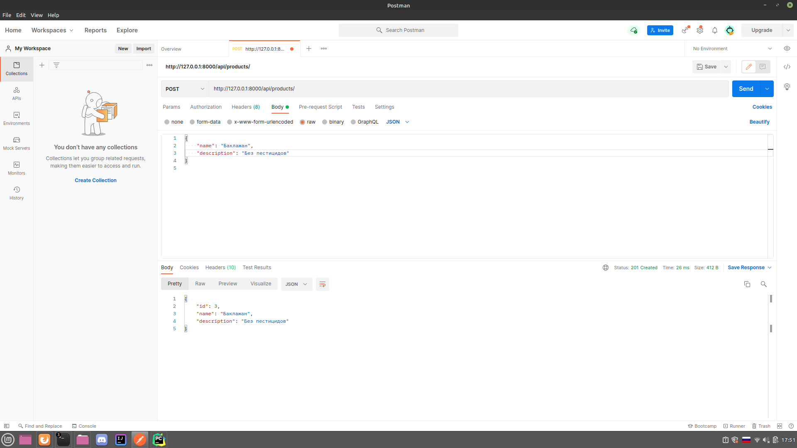
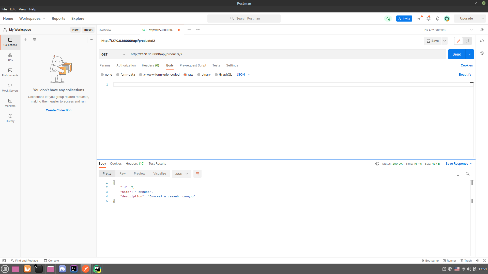
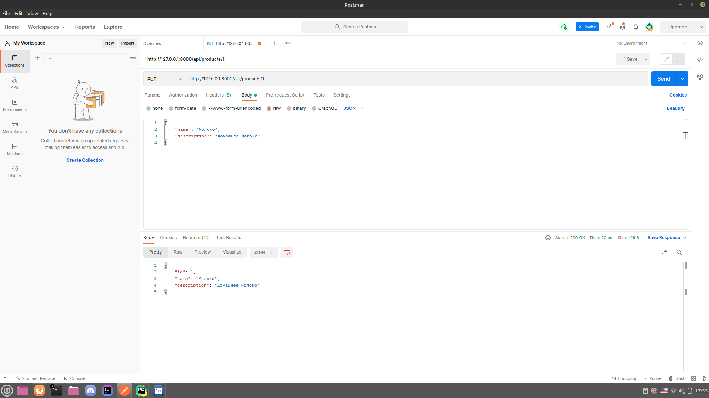
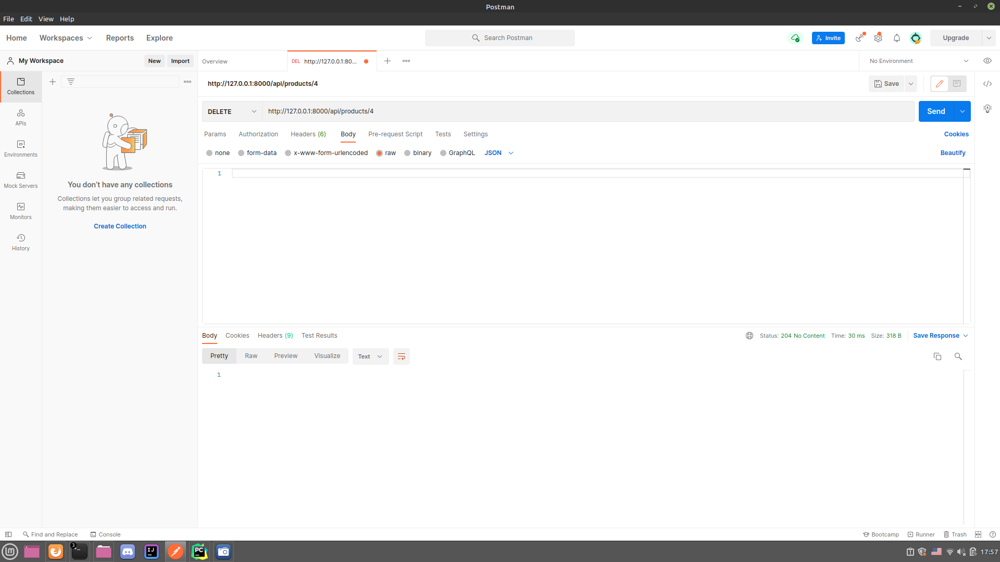
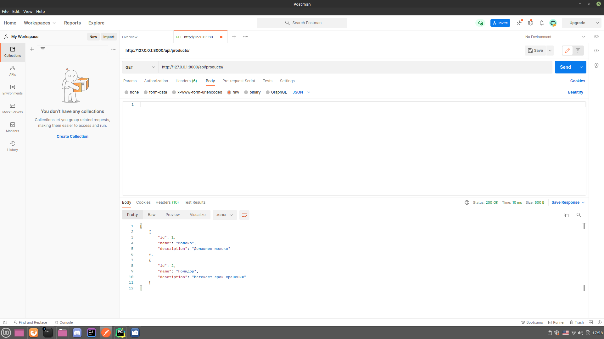

Сначала добавим несколько товаров в базу данных методом POST:

Get без id:

Get c id:

Метод Put:

Метод Patch:

Метод Delete (id не 3, а 4, потому что я забыл сделать скриншот после удаления
объекта с id = 3 и пришлось добавлять новый объект):

Результат Get после Put, Patch и Delete:

