### Задание А.

1. ip адресов достаточно много, например 49.7.37.133

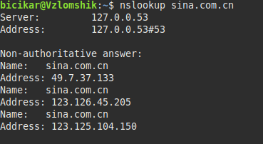

2. Для Оксфордского университета:

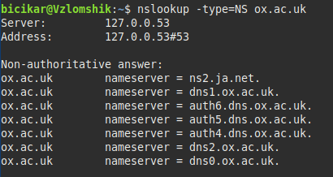

3. Подойдет сайт `sina.com.cn` из пункта 1. Адреса моего учебного заведения:

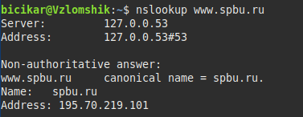

### Задание Б.

1. Запрос отправлен по UDP.
2. Порт 53

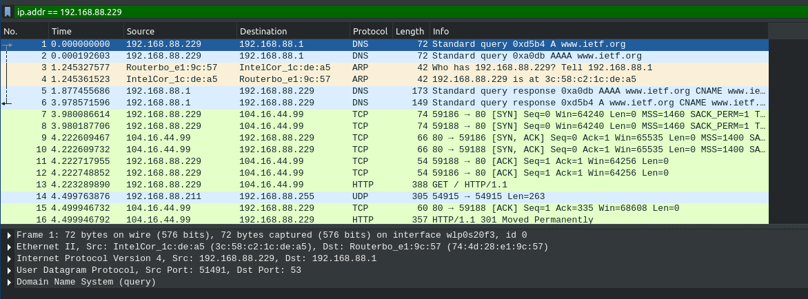

3. Запрос был отправлен на адрес 192.168.88.1. Локальный адрес такой же.

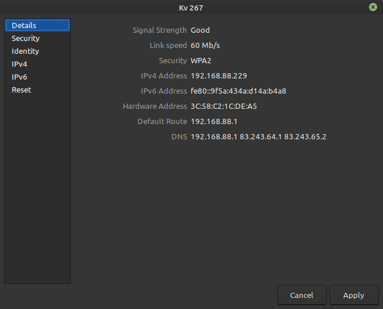

4. Запрашивается запись типа А на ip адреса. Ответов нет.

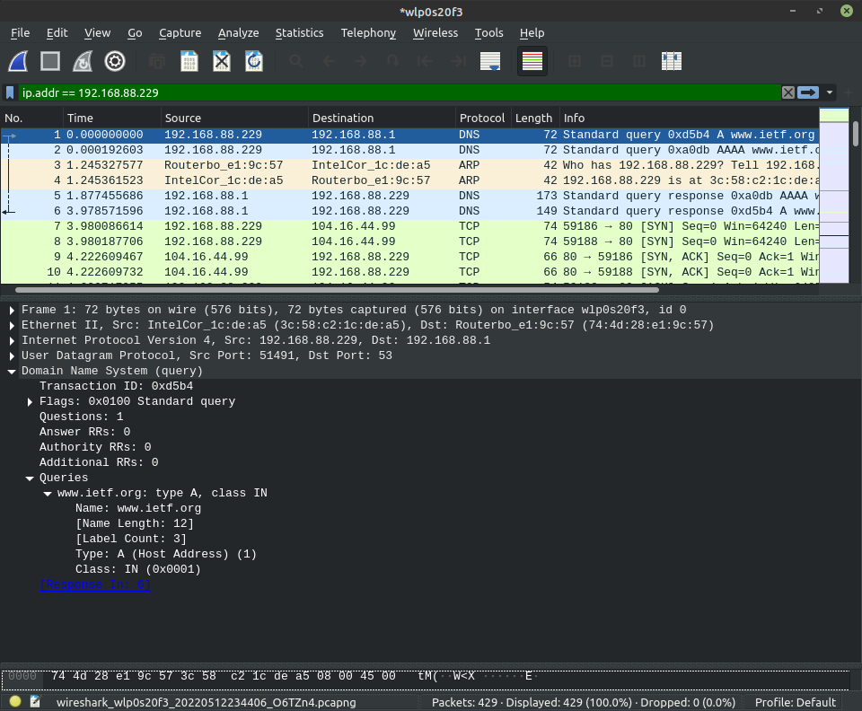
   
5. В ответном сообщении содержатся ответы - ip адреса, их классы, размер данных и время которое ответ будет правильным.

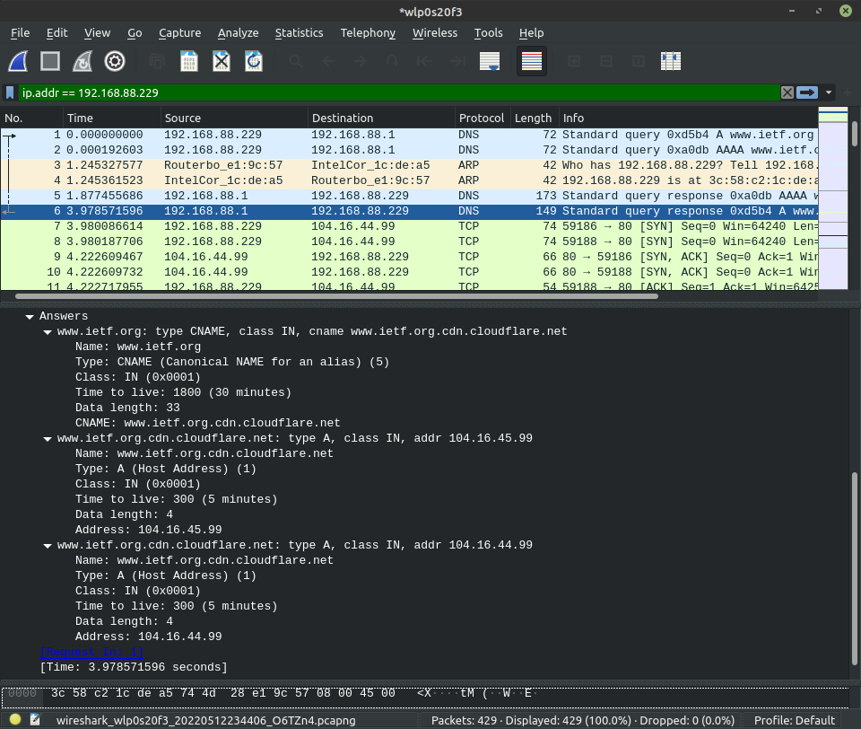

6. Следующий TCP запрос с флагом SYN действительно отправляется на один из IP адресов, указанных в ответе (третий)

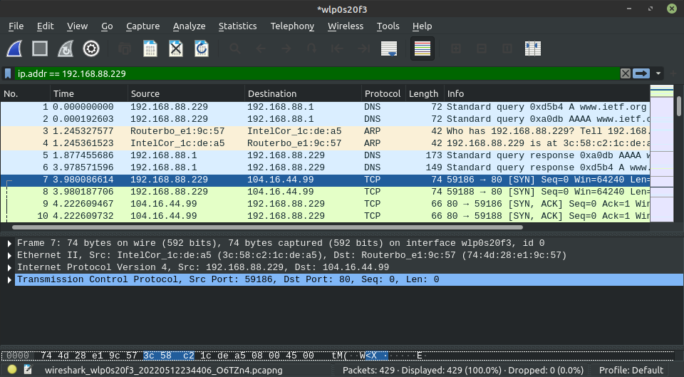

7. Выполняется еще один запрос DNS следом за первым. Но судя по всему, выполняется он не из-за картинок
 и запрашивается как будто бы то же самое.

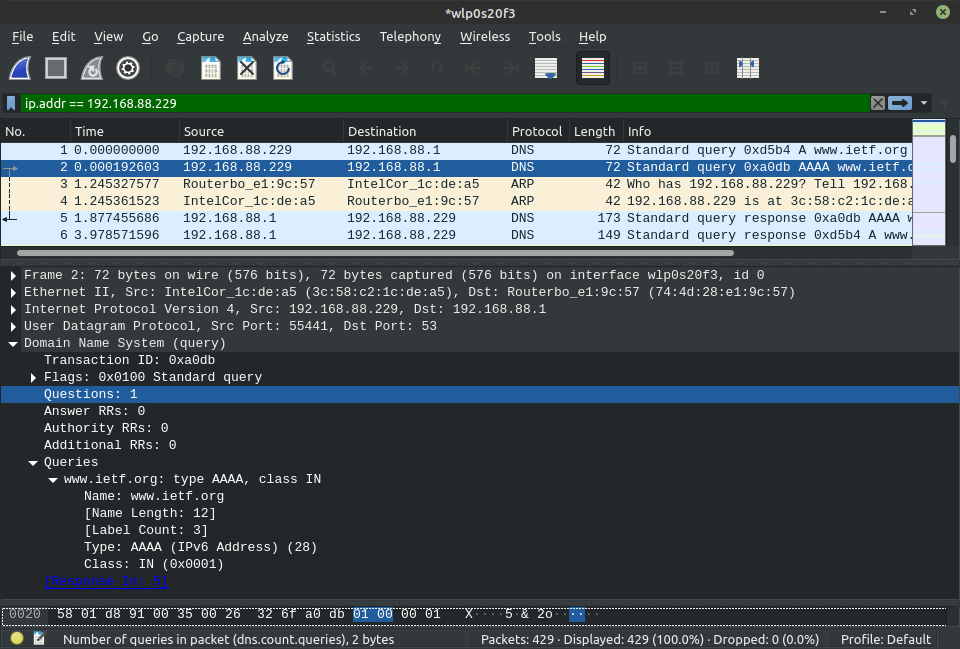   

### Задание В.

1. В DNS запросе порт назначения и в DNS ответе порт источника один и тот же - 53
2. Запрос отправлены на 192.168.88.1. Это адрес локального DNS сервера.
3. В сообщении-запросе запрашивается тип АААА, ответов нет.

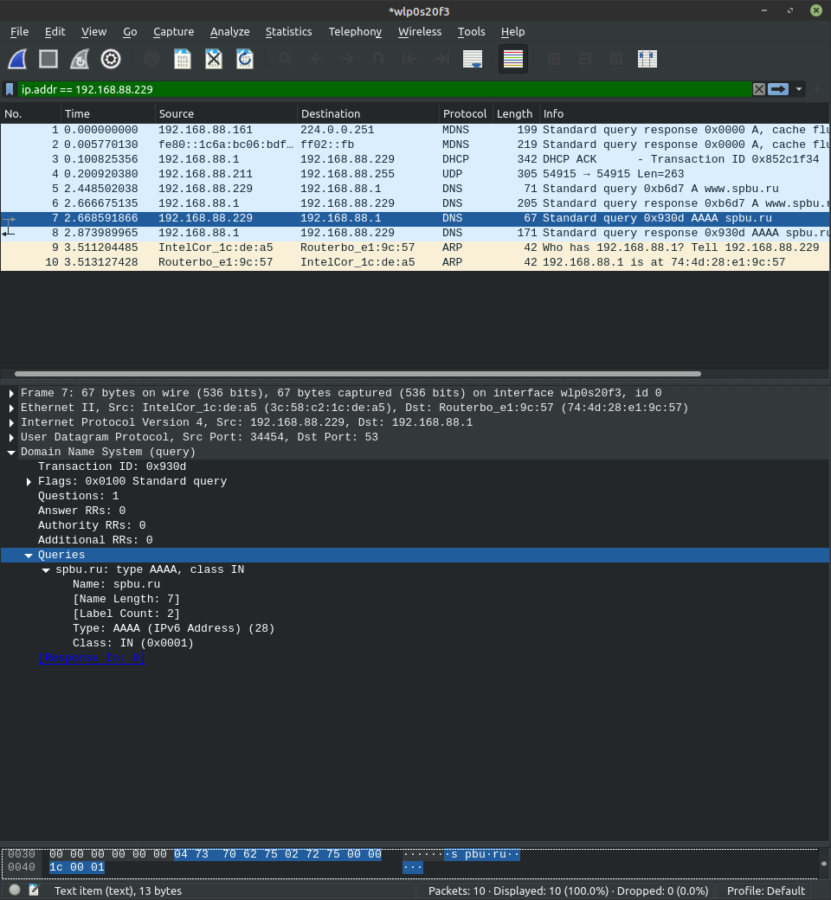

4. В ответе пришло много информации о сервере. Самих по себе "ответов", "answers", нет.

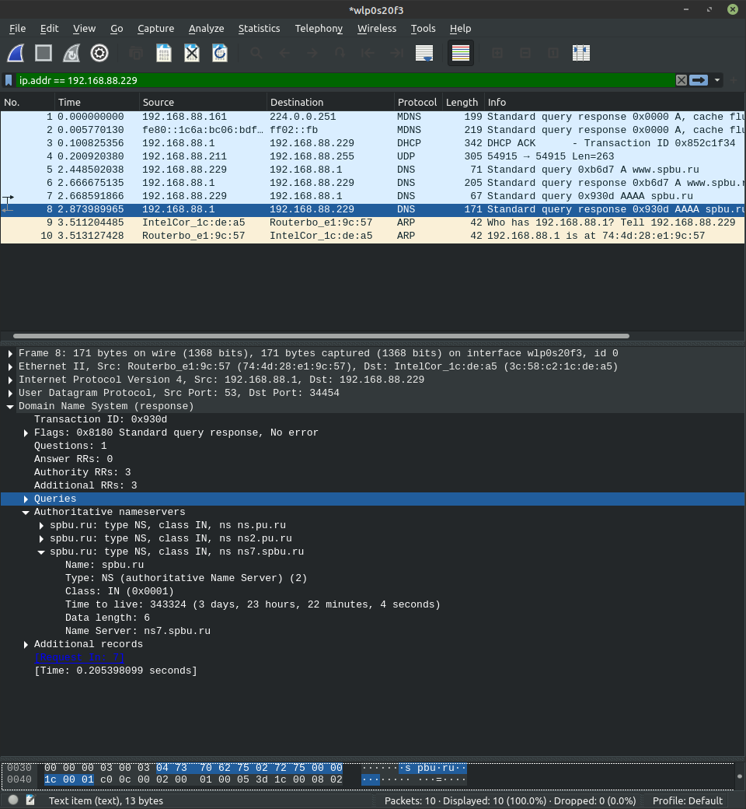

### Задание Г.

1. Запросы опять идут на локальный DNS сервер. 
2. Запрашивается запись типа NS. Ответов нет.

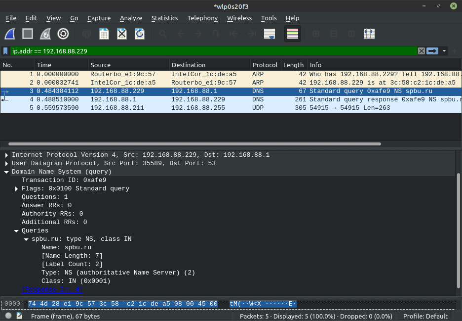

3. В ответе имена nameserver-ов, при этом их ip адреса не указаны.

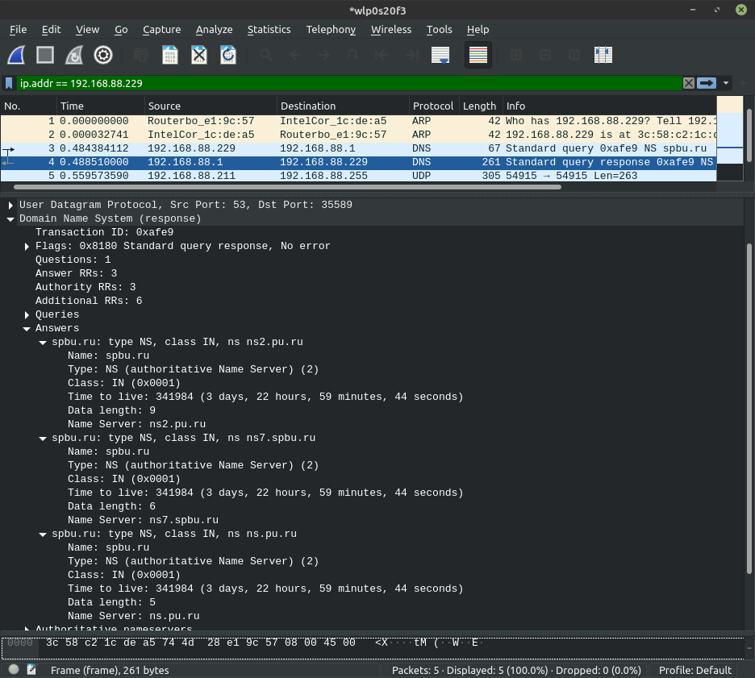

### Задание Д.

1. Сначала происходит 2 запроса типа А и АААА, адрес совпадает с адресом ip сервера по умолчанию.
   Затем еще 2 запроса на адрес 195.70.196.210, это адрес спбгу.
2. В запросах типа A и AAAA, отправленных на адрес спбгу, ответов нет.
3. В ответе типа А есть 2 ответа, CNAME и A, в ответе типа АААА ответов нет, но есть Authoritative nameservers

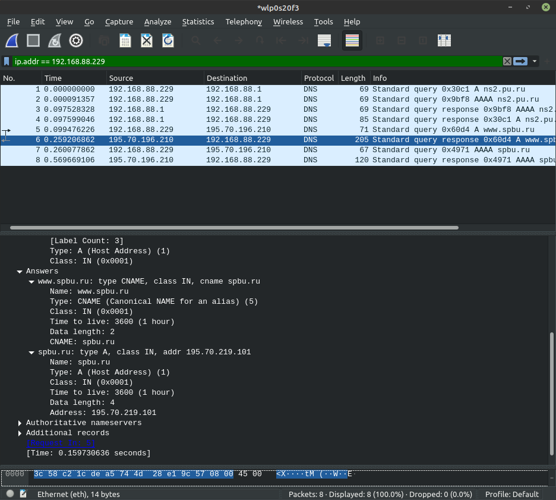

### Задание Е.

1. WHOIS — сетевой протокол прикладного уровня, базирующийся на протоколе TCP. Основное применение — получение регистрационных данных о владельцах доменных имён, IP-адресов и автономных систем. 
2. Используем [www.nic.ru](www.nic.ru) и [whois.ru](whois.ru)

[yandex.ru](yandex.ru):

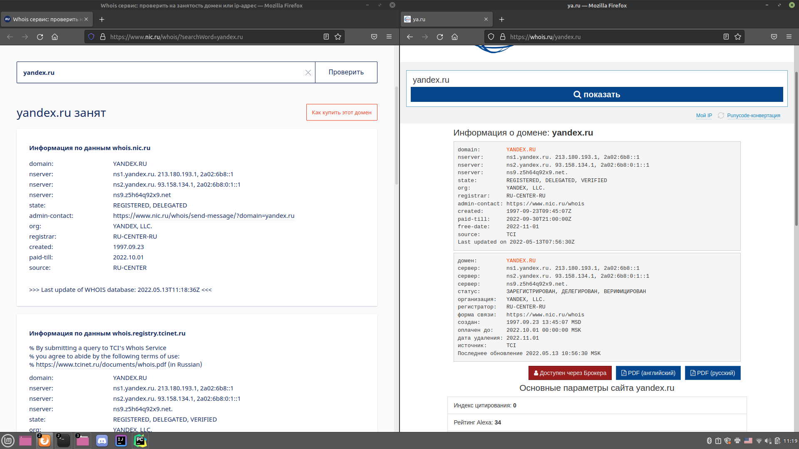

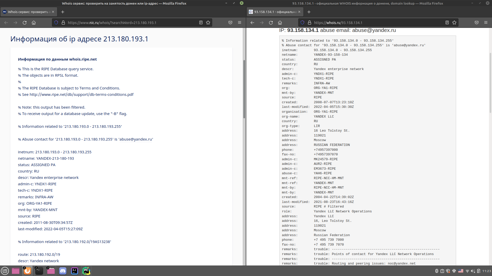

[spbu.ru](spbu.ru):

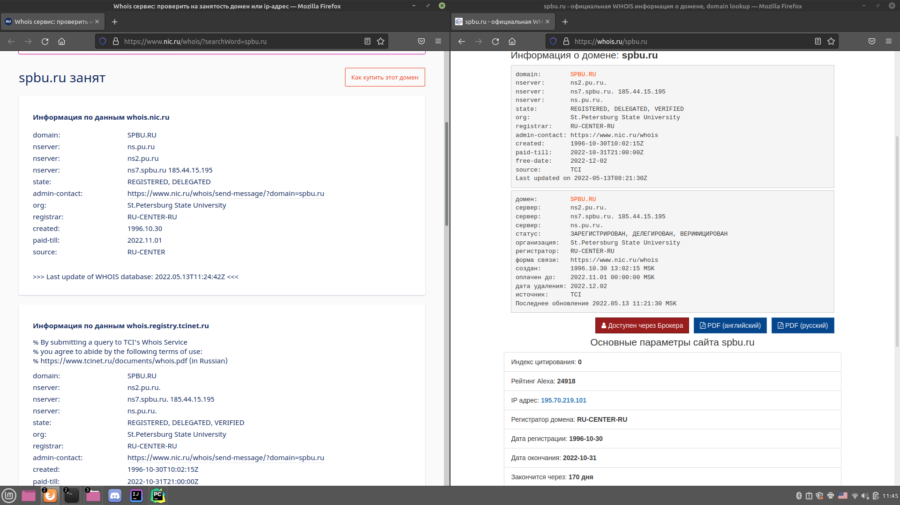

3. Запросы в nslookup:

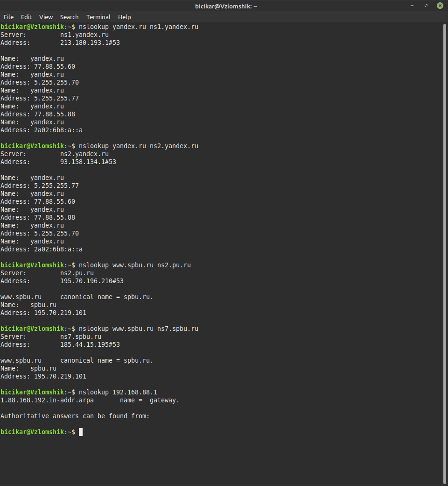