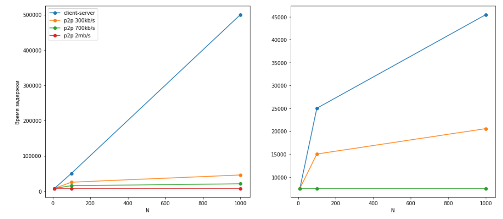

### Задание 2

### Задание 3

1. Когда скорость отдачи с сервера меньше суммарной скорости загрузки клиентов, все упирается в `u_s`.
Сервер должен раздать `FN` бит, может делать это со скоростью не больше чем `u_s`.
   Если все время раздача идет с такой скоростью, то нужная оценка `NF/u_s` достигается.
   
2. Когда пиры суммарно готовы принять меньше, чем сервер готов отдать. Получим, что все
упирается в самого медленного пира и общее время зависит от него, составляет `F/d_min`
   
3. По предыдущим пунктам получаем, что все зависит от того, что быстрее: прием пирами или отдача сервера.
Скорость либо упирается в скорость загрузки пирами тогда второй вариант,
   либо упирается в скорость отдачи сервера, т.е. первый вариант. При этом сверху ограничено обоими вариантами.