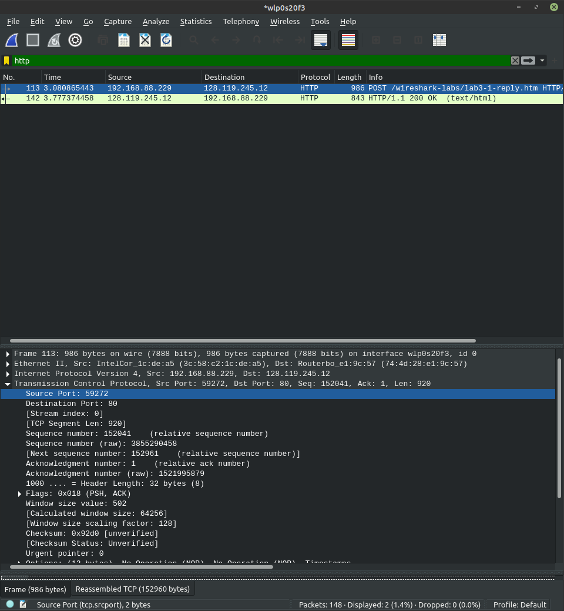
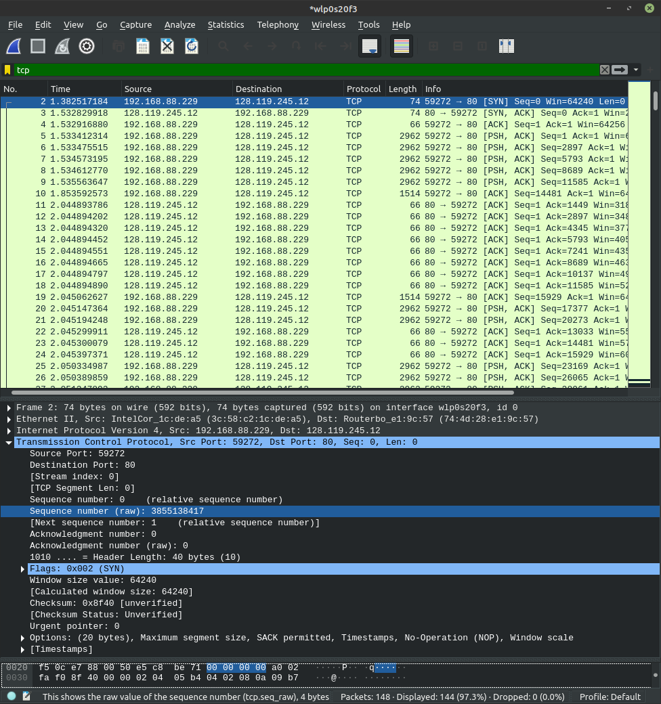
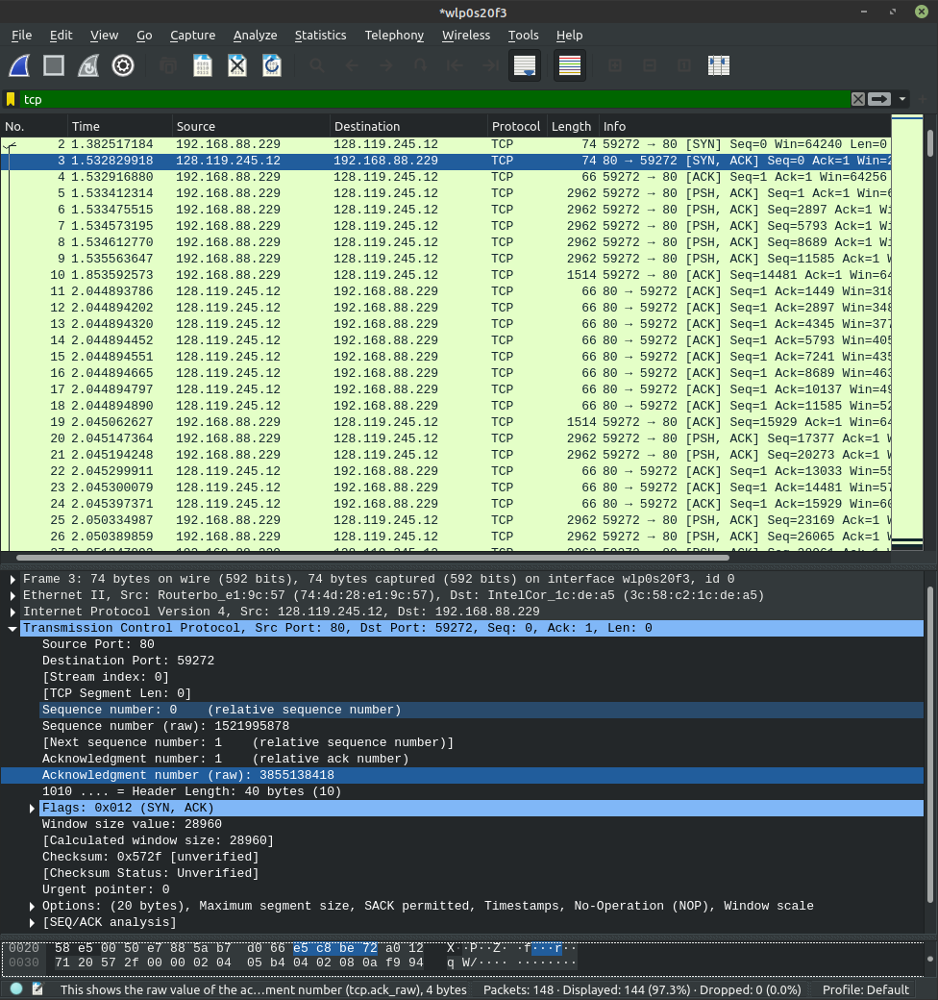
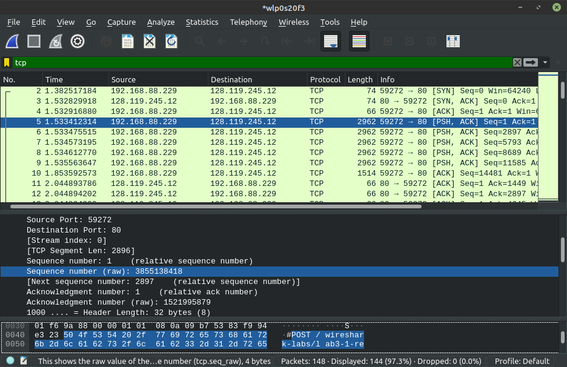
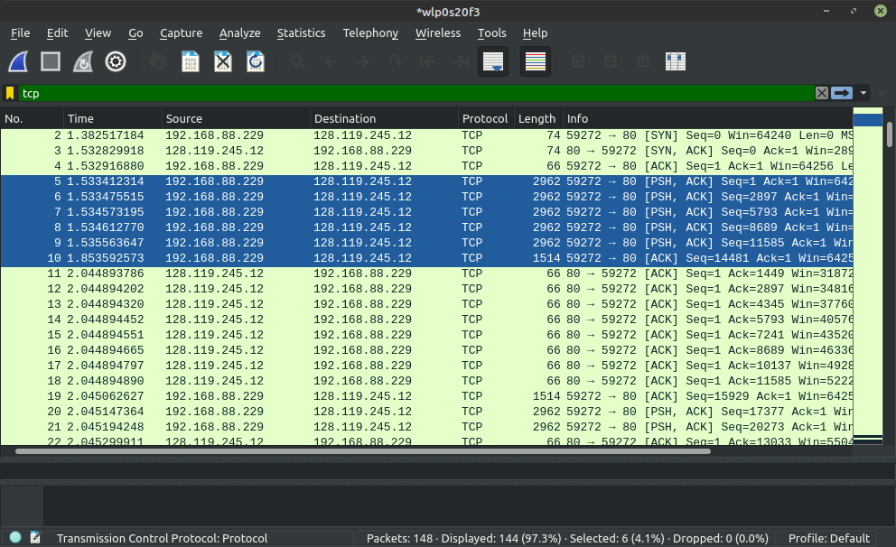
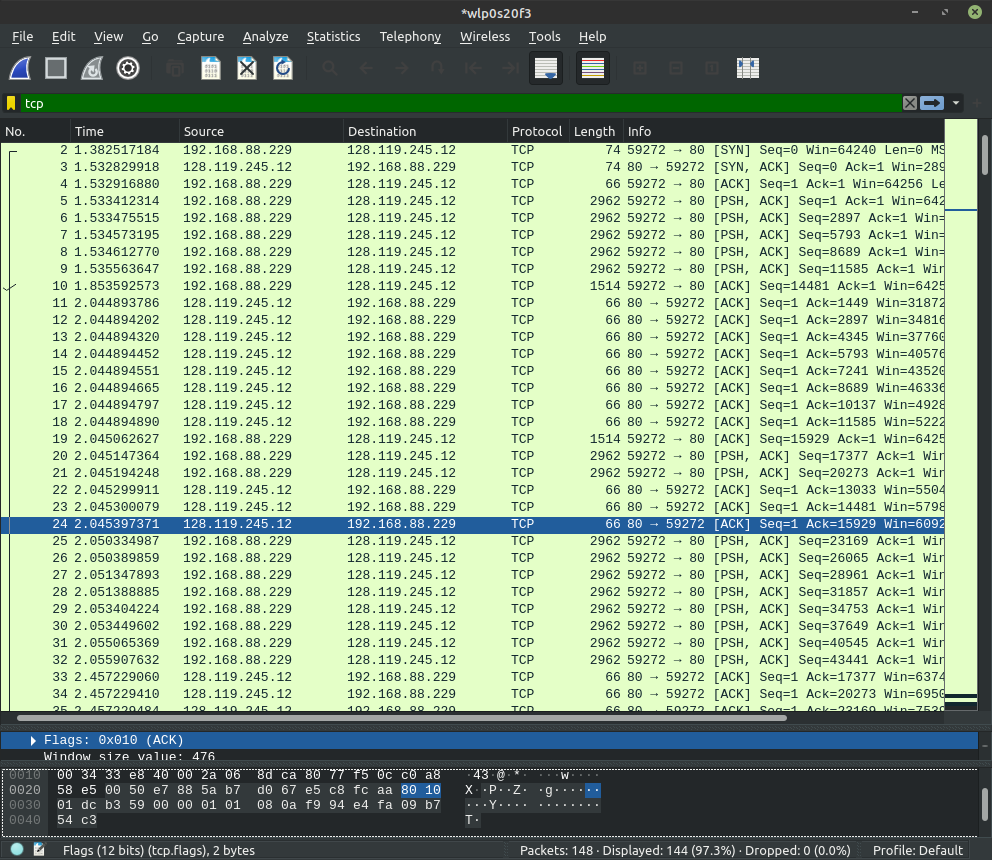
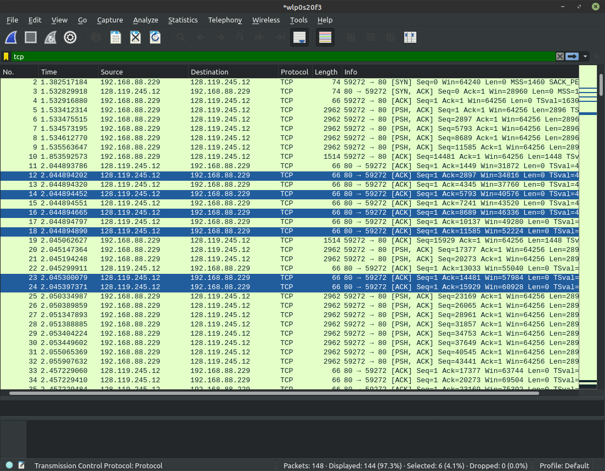
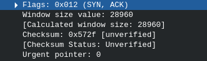
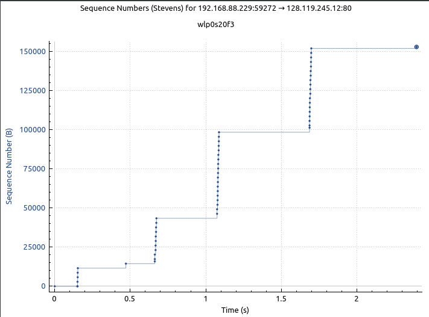

1. Адрес отправителя: 192.168.88.229, порт 59272
2. Адрес получателя: 128.119.245.12, порт 80

3. Является SYN пакетом, т.к. установлен соответствующий флаг.
Порядковый номер: Sequence number (raw): 3855138417

4. Порядковый номер SYNACK пакета равен 1521995878. Имеет флаги SYN и ACK.
Номер подтверждения равен 3855138418 = 3855138417 + 1 (порядковый номер отправителя + 1, считывание SYN флага)
   

5. Sequence number (raw): 3855138418

6. 
| Относительный порядковый номер | Время отправления | Время получения | RTT         |
|--------------------------------|-------------------|-----------------|-------------|
| 1                              | 1.533412314       | 2.044894202     | 0.511481888 |
| 2897                           | 1.533475515       | 2.044894452     | 0.511418937 |
| 5793                           | 1.534573195       | 2.044894665     | 0.51032147  |
| 8689                           | 1.534612770       | 2.044894890     | 0.51028212  |
| 11585                          | 1.535563647       | 2.045300079     | 0.509736432 |
| 14881                          | 1.853592573       | 2.045397371     | 0.191804798 |

7. Размер окна 28960 * 128 бит. Общее время отправки = получение последнего - отправка первого =
2.045397371 - 1.533412314 = 0.511985057. Тогда пропускная способность равна
   28960 * 128 / 0.511985057 = 0.9 Мбайт/сек
   

8.  
