## Задание 1. Wireshark

### Ping

Сайт: aub.edu.bd

1. 

```
$ ping -c 10 aub.edu.bd
PING aub.edu.bd (162.0.209.199) 56(84) bytes of data.
64 bytes from business94-4.web-hosting.com (162.0.209.199): icmp_seq=1 ttl=46 time=203 ms
64 bytes from business94-4.web-hosting.com (162.0.209.199): icmp_seq=2 ttl=46 time=224 ms
64 bytes from business94-4.web-hosting.com (162.0.209.199): icmp_seq=3 ttl=46 time=247 ms
64 bytes from business94-4.web-hosting.com (162.0.209.199): icmp_seq=4 ttl=46 time=195 ms
64 bytes from business94-4.web-hosting.com (162.0.209.199): icmp_seq=5 ttl=46 time=292 ms
64 bytes from business94-4.web-hosting.com (162.0.209.199): icmp_seq=6 ttl=46 time=212 ms
64 bytes from business94-4.web-hosting.com (162.0.209.199): icmp_seq=7 ttl=46 time=236 ms
64 bytes from business94-4.web-hosting.com (162.0.209.199): icmp_seq=8 ttl=46 time=257 ms
64 bytes from business94-4.web-hosting.com (162.0.209.199): icmp_seq=9 ttl=46 time=280 ms
64 bytes from business94-4.web-hosting.com (162.0.209.199): icmp_seq=10 ttl=46 time=200 ms

--- aub.edu.bd ping statistics ---
10 packets transmitted, 10 received, 0% packet loss, time 9014ms
rtt min/avg/max/mdev = 194.881/234.529/292.330/32.261 ms
```

Мой ip адрес: 192.168.88.229, ip адрес хоста назначения: 162.0.209.199

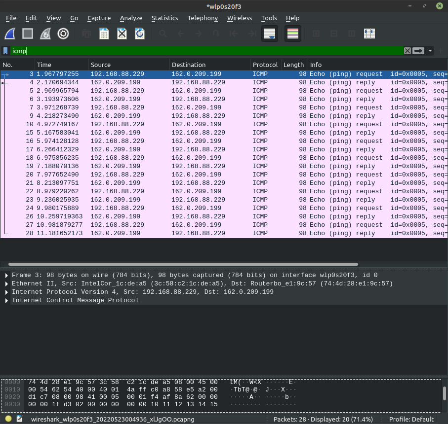

2. ICMP протокол предназначен для передачи данных между хостами, это протокол 
сетевого уровня, а не для передачи данных между процессами на данных хостах.
   Порты идентифицируют приложение, поэтому информация о них в протоколе ICMP не хранится.
   
3. ICMP тип: 8, кодовый номер 0. Помимо типа и кодового номера, в пакете содержится
контрольная сумма, идентификатор, порядковый номер, информация о времени на отправителе
   и поле данных. На каждое из полей контрольной суммы, идентификатора и порядкового номера
   приходится по 2 байта.
   
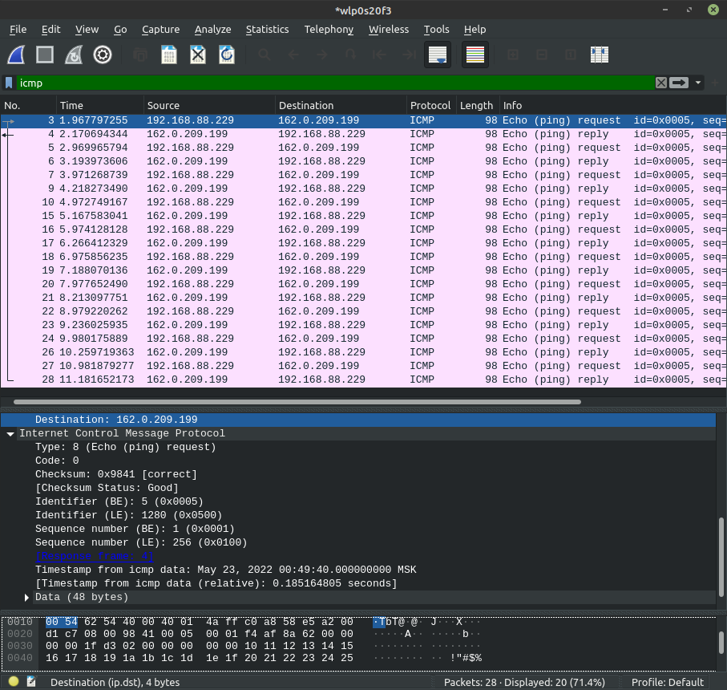

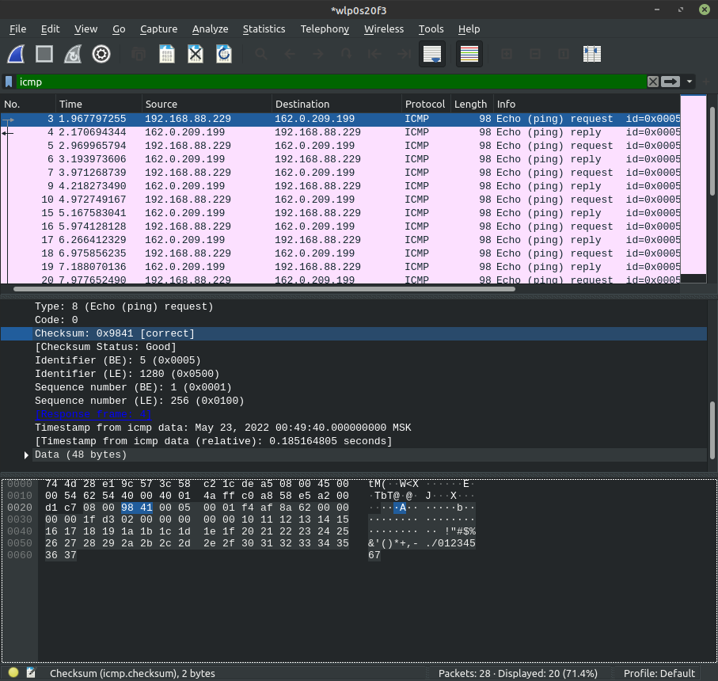

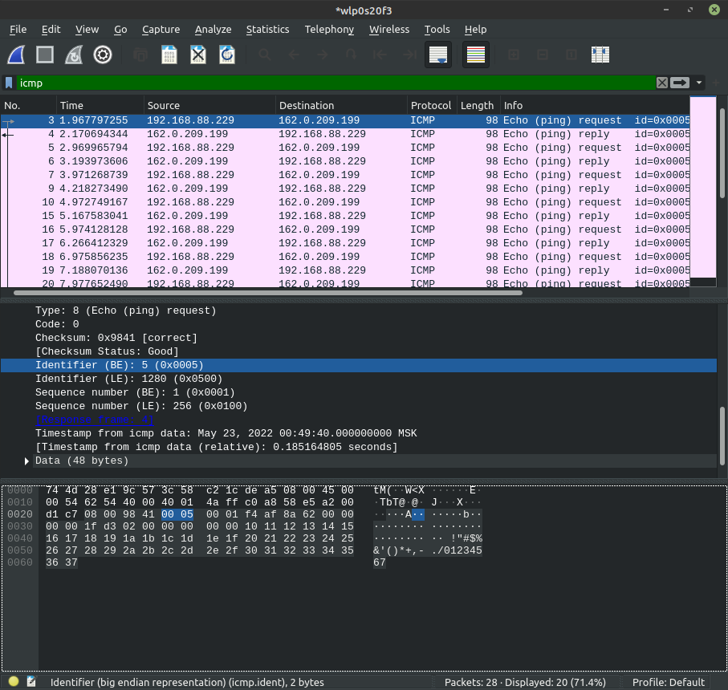

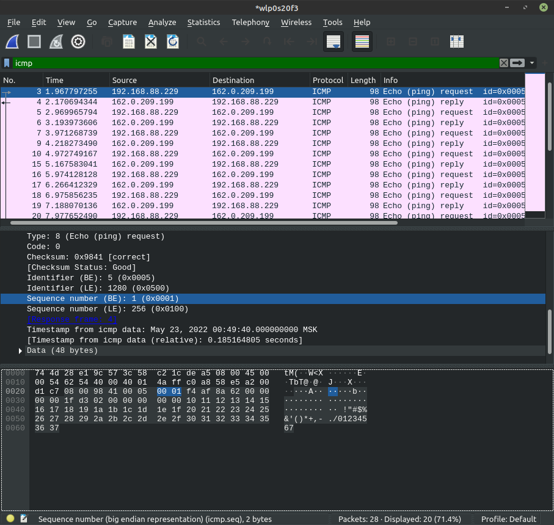

4. ICMP тип: 0, кодовый номер пакета 0.

В пакете также содержатся контрольная сумма, идентификатор, порядковый номер,
информация о времени и поле данных. На каждое из полей контрольной суммы, идентификатора,
порядкового номера приходится 2 байта.

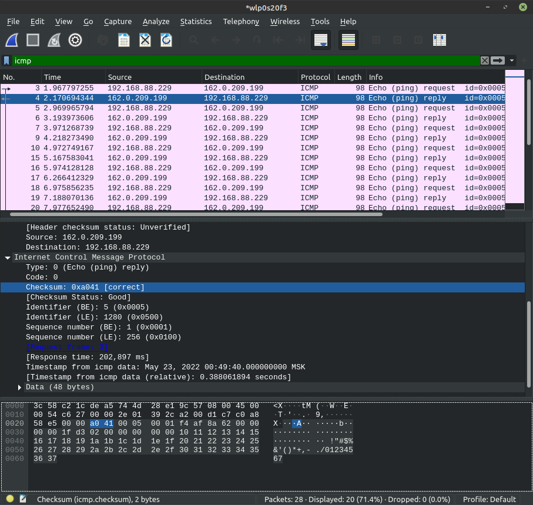

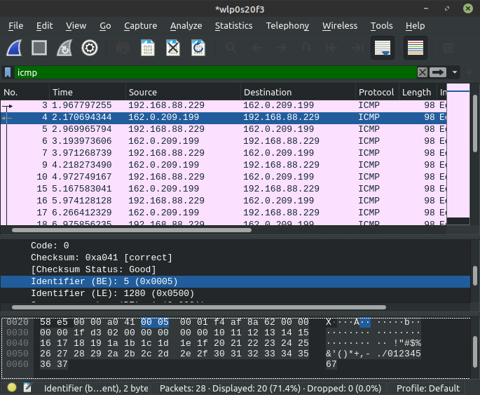

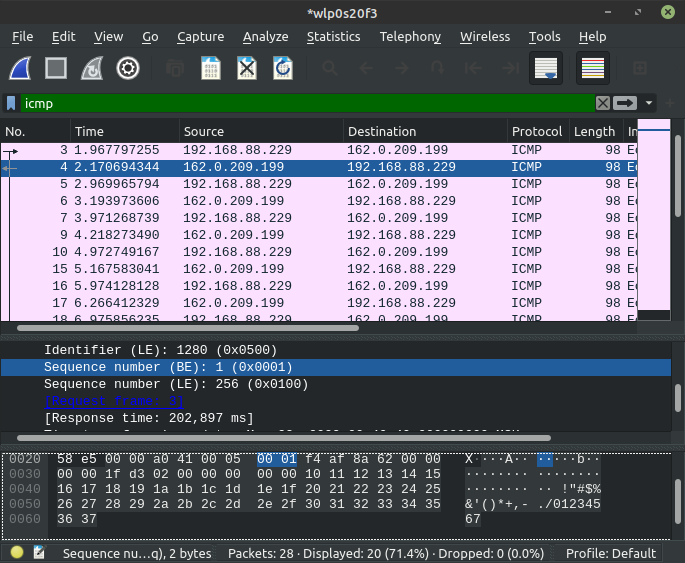

## Traceroute

1. Пришлось перейти на Windows, чтобы выполнялись ping icmp request. Возможное отличие -
отсутствие данных о времени. Глобальных изменений особо нет.

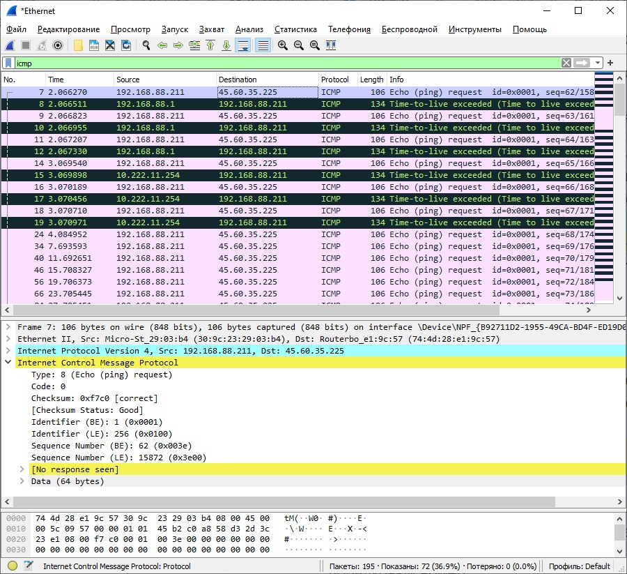

2. Дополнительно появилось поле с информацией про IP: адреса отправителя, получателя,
версия протокола, TTL и др. Также присутствуют первые 8 байт исходного запроса, 
   содержащие тип, код, контрольную сумму, идентификатор и порядковый номер
   
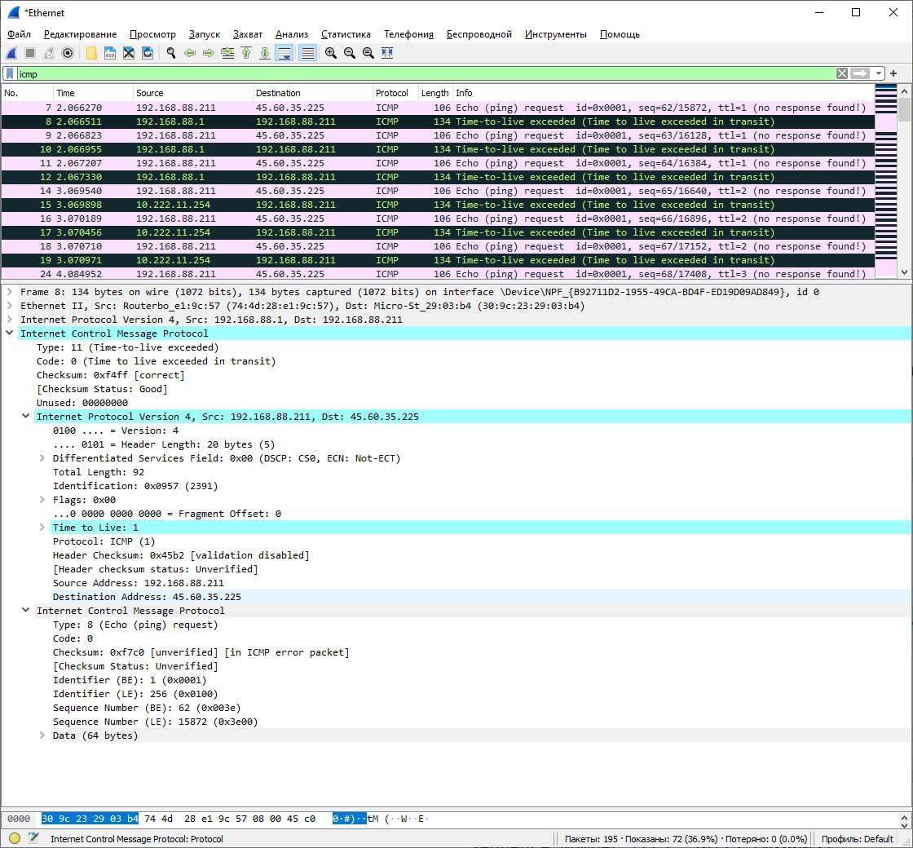

3. В последних трех запросах данные успели дойти до назначения до того, как TTL стал равен 1.
В них отличается тип (0 вместо 11), а также отсутствует поле с информацией про IP.
   
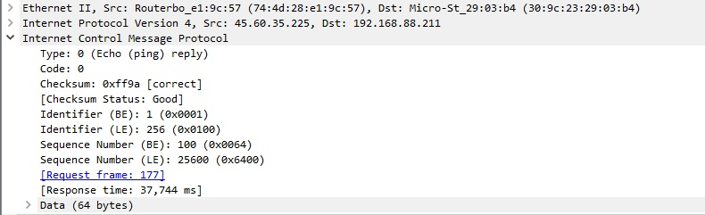

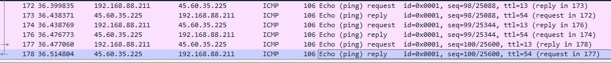

4. Существенная задержка наблюдается между 10 и 11 шагами. Это сервера Стокгольма и Амстердама.

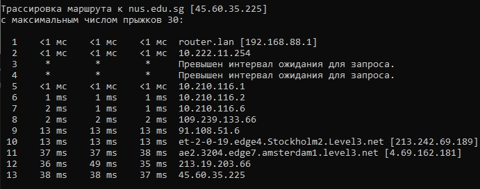
